# post-processing-scripts
This repository features all the post-processing scripts that I have written during my master's thesis in Polytechnique Montréal.

The folders are named after the example that is post processed. Each of the folders contains the .py files used to perform the post-processing and the resulting figures. The python scripts require the original simulation data to be able to reproduce the figures, hence it will not work if used as if. The goal is to show how it was done and keep a trace of it.

The animations folder contains numerous animations made during my master's thesis they are shown below.

    <a href="https://github.com/chaos-polymtl/lethe" target="_blank" rel="noreferrer">
        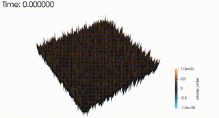
    </a>
    <a href="https://github.com/chaos-polymtl/lethe" target="_blank" rel="noreferrer">
        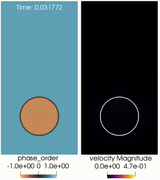
    </a>
    <a href="https://github.com/chaos-polymtl/lethe" target="_blank" rel="noreferrer">
        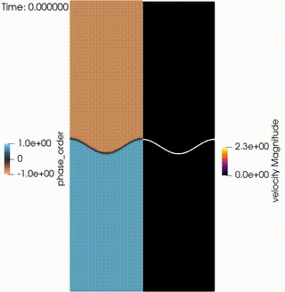
    </a>
    <a href="https://github.com/chaos-polymtl/lethe" target="_blank" rel="noreferrer">
        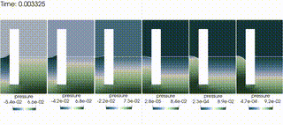
    </a>
    <a href="https://github.com/chaos-polymtl/lethe" target="_blank" rel="noreferrer">
        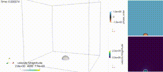
    </a>
    <a href="https://github.com/chaos-polymtl/lethe" target="_blank" rel="noreferrer">
        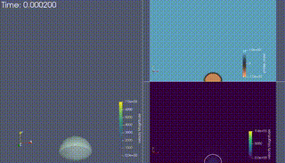
    </a>
    <a href="https://github.com/chaos-polymtl/lethe" target="_blank" rel="noreferrer">
        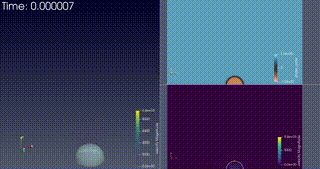
    </a>
    <a href="https://github.com/chaos-polymtl/lethe" target="_blank" rel="noreferrer">
        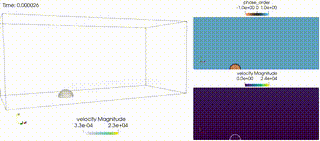
    </a>
        <a href="https://github.com/chaos-polymtl/lethe" target="_blank" rel="noreferrer">
        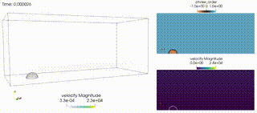
    </a>
    <a href="https://github.com/chaos-polymtl/lethe" target="_blank" rel="noreferrer">
        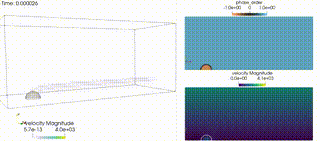
    </a>
        <a href="https://github.com/chaos-polymtl/lethe" target="_blank" rel="noreferrer">
        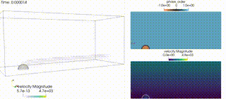
    </a>
    <a href="https://github.com/chaos-polymtl/lethe" target="_blank" rel="noreferrer">
        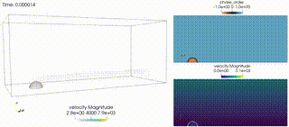
    </a>

 
